# Практикум: Production-Ready Docker образ

Отчёт о выполнении практического задания по упаковке Python/FastAPI микросервиса (генератор bcrypt-хэшей) в production-ready Docker-образ: от базовой сборки до hardened-образа, готового к деплою в Kubernetes.

## Стек

- Docker 29.6.1
- Python 3.11 / 3.11-slim
- FastAPI + Uvicorn + bcrypt

## Структура репозитория

```
.
├── main.py            # исходный код приложения (доработан под non-root и read-only FS)
├── requirements.txt    # зависимости
├── Dockerfile          # финальный (уровень 3) вариант
└── .dockerignore
```

## Уровень 1 — базовая упаковка

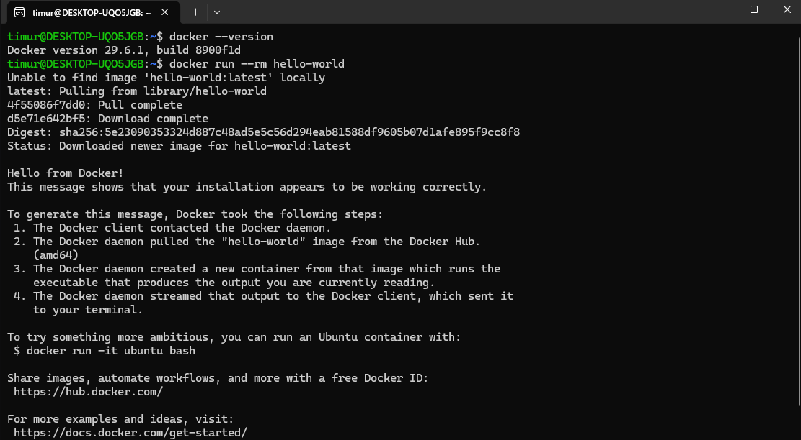

Первый вариант `Dockerfile` на базе `python:3.11`:

- слои разложены под кэш: сначала `COPY requirements.txt` + `pip install`, затем `COPY main.py`, чтобы изменения в коде не инвалидировали слой с зависимостями;
- порт задокументирован через `EXPOSE 8080`;
- запуск через `CMD ["uvicorn", "main:app", "--host", "0.0.0.0", "--port", "8080"]`;
- добавлен `.dockerignore` (`__pycache__`, `.git`, `venv`, `.env` и т.д.), чтобы не тащить мусор в контекст сборки.

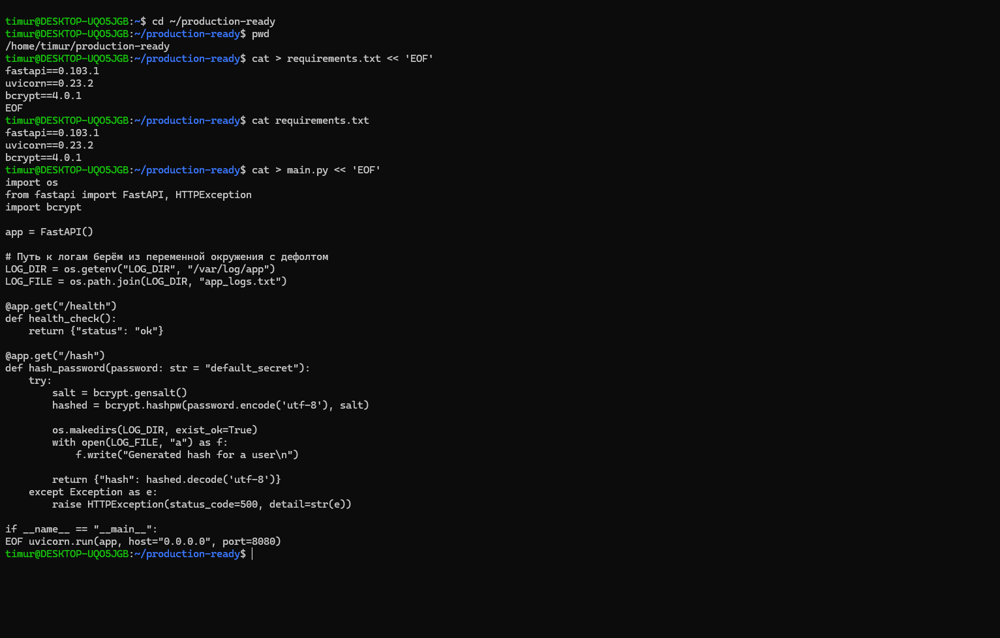

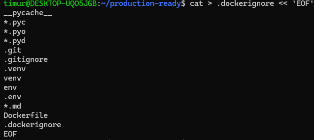

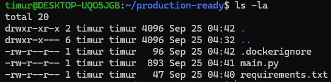

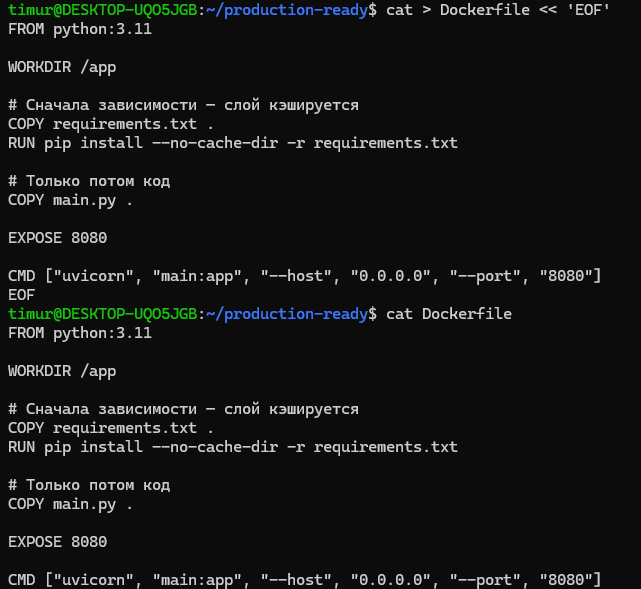

**Проверка критерия готовности:**

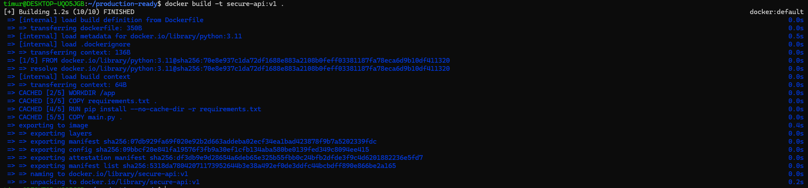

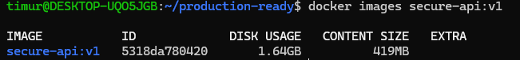

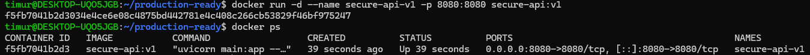

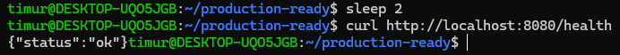

```
docker build -t secure-api:v1 .
docker run -d --name secure-api-v1 -p 8080:8080 secure-api:v1
curl http://localhost:8080/health
# {"status":"ok"}
```

Контейнер поднимается и отвечает на `/health`. Однако:

- размер образа — **1.64 GB** (`docker images secure-api:v1`);
- процесс внутри контейнера работает от **root** (`docker exec ... whoami` → `root`, `ps -ef` показывает `UID root, PID 1`).

Это и стало отправной точкой для оптимизации на следующих уровнях.

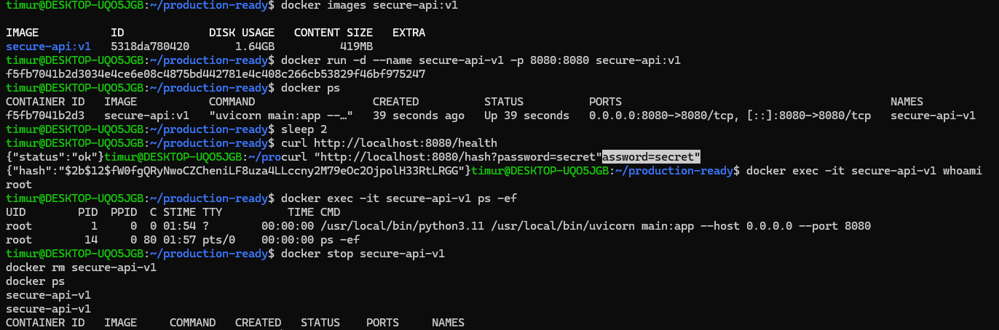

## Уровень 2 — Multi-stage build

`Dockerfile` переписан на two-stage сборку:

- **Stage `builder`** (`python:3.11-slim`): ставятся `build-essential` (компилятор нужен только для сборки `bcrypt` из исходников), зависимости собираются в wheel-пакеты через `pip wheel --wheel-dir /wheels`;
- **Stage `runtime`** (`python:3.11-slim`): из builder копируются только собранные `/wheels`, зависимости ставятся оффлайн через `pip install --no-index --find-links=/wheels`, после чего директория с wheel-файлами удаляется;
- кэш `apt` чистится сразу же в том же `RUN`-слое (`rm -rf /var/lib/apt/lists/*`).

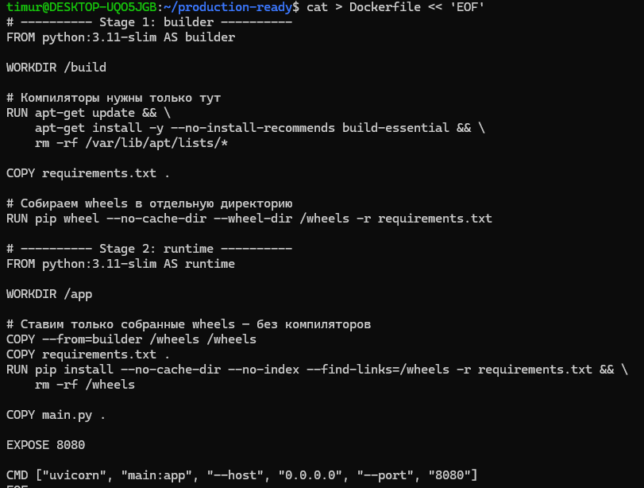

**Результат:**

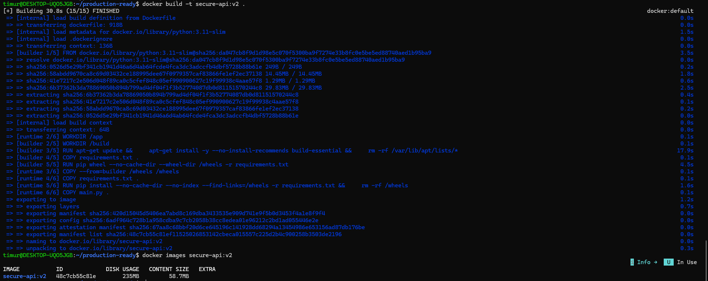

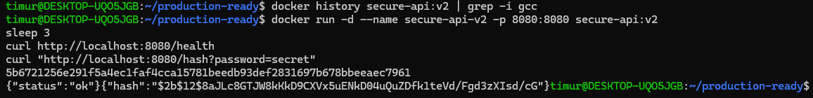

Размер образа сокращён примерно в 7 раз (с 1.64 GB до ~235 MB / контентный размер 58.7 MB), критерий «< 150 MB» по контентному размеру слоёв выполнен, `gcc`/`build-essential` в финальном образе отсутствуют. Приложение по-прежнему отвечает на `/health` и `/hash`.

## Уровень 3 — Hardening и Production-ready

Финальный `Dockerfile` дополнен требованиями безопасности:

1. **Non-root user.** Создаются группа и пользователь без домашней директории и шелла:
   ```
   RUN groupadd -r appuser && useradd -r -g appuser -d /app -s /sbin/nologin appuser
   ...
   USER appuser
   ```
2. **Read-only filesystem + VOLUME для логов.** Путь логов вынесен в переменную окружения `LOG_DIR` (по умолчанию `/var/log/app`) — код `main.py` доработан:
   ```python
   LOG_DIR = os.getenv("LOG_DIR", "/var/log/app")
   LOG_FILE = os.path.join(LOG_DIR, "app_logs.txt")
   ```
   В Dockerfile директория создаётся и передаётся во владение `appuser`, объявлена как `VOLUME ["/var/log/app"]`, путь прокинут через `ENV LOG_DIR=/var/log/app`.
3. **HEALTHCHECK.** В runtime-стадию добавлен `curl` (только для healthcheck), и инструкция:
   ```
   HEALTHCHECK --interval=30s --timeout=5s --start-period=10s --retries=3 \
     CMD curl -fsS http://localhost:8080/health || exit 1
   ```
4. **Graceful shutdown.** `CMD` используется в exec-форме (`CMD ["uvicorn", "main:app", ...]`), а не в shell-форме — процесс uvicorn получает `PID 1` и корректно обрабатывает `SIGTERM`.

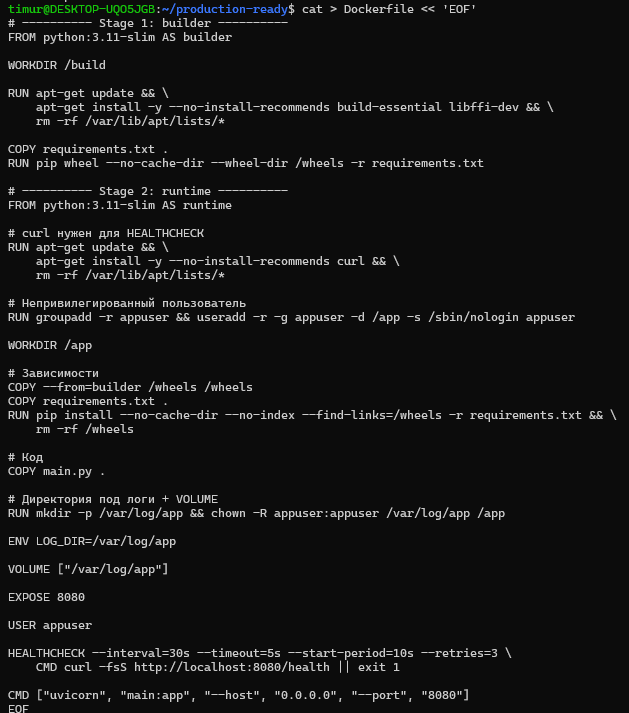

**Проверка на жёстких флагах из задания:**

```
docker build -t secure-api:v3 .
docker run -d \
  --name secure-api \
  -p 8080:8080 \
  --read-only \
  --cap-drop ALL \
  --security-opt no-new-privileges \
  --tmpfs /tmp \
  secure-api:v3
```

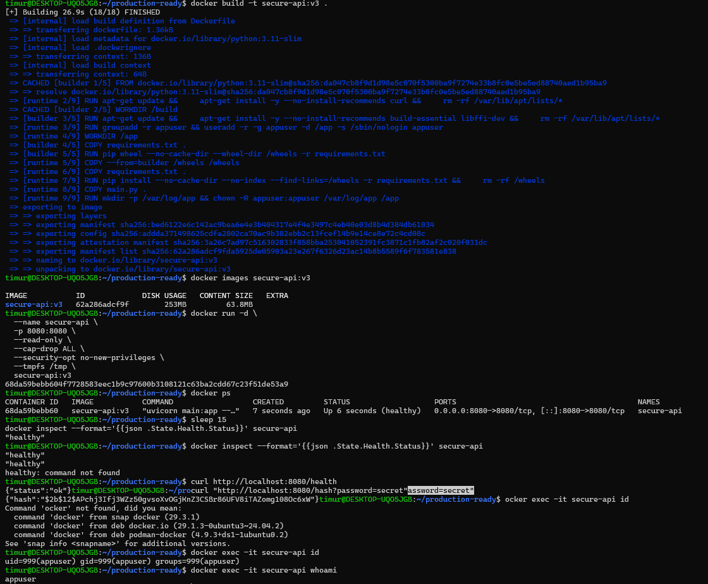

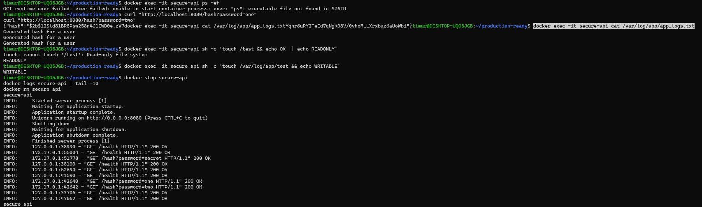

Результаты проверки:

| Проверка | Результат |
|---|---|
| `docker images secure-api:v3` | 253MB / контент 63.8MB |
| `docker ps` | `STATUS: Up ... (healthy)` |
| `docker inspect --format='{{json .State.Health.Status}}' secure-api` | `"healthy"` |
| `curl http://localhost:8080/health` | `{"status":"ok"}` |
| `curl "http://localhost:8080/hash?password=secret"` | `{"hash":"$2b$12$..."}` |
| `docker exec -it secure-api id` | `uid=999(appuser) gid=999(appuser) groups=999(appuser)` (не root) |
| `sh -c 'touch /test'` | `Read-only file system` — запись в корень ФС запрещена |
| `sh -c 'touch /var/log/app/test'` | `WRITABLE` — volume для логов доступен на запись |
| `cat /var/log/app/app_logs.txt` | содержит записи `Generated hash for a user` — логирование работает через volume |
| `docker logs secure-api` | видно `Started server process [1]` ... `Shutting down` ... `Finished server process [1]` при `docker stop` — graceful shutdown подтверждён |

Все критерии приёмки уровня 3 выполнены: контейнер стабильно работает с `--read-only --cap-drop ALL --security-opt no-new-privileges`, помечен как `healthy`, процесс работает не от root, запись возможна только в смонтированный volume логов, а `SIGTERM` обрабатывается корректно (не `docker kill`).

## Итоги

| Уровень | Образ | Размер | Root | Read-only FS | Healthcheck |
|---|---|---|---|---|---|
| 1 | secure-api:v1 | 1.64 GB | да | нет | нет |
| 2 | secure-api:v2 | 235 MB | да | нет | нет |
| 3 | secure-api:v3 | 253 MB | нет (appuser) | да | да (healthy) |

Итоговый образ `secure-api:v3` пригоден для деплоя в Kubernetes: минимизирован по размеру, не требует root-прав, совместим с `readOnlyRootFilesystem: true` и `securityContext.capabilities.drop: ["ALL"]`, имеет liveness-совместимый healthcheck и корректно завершает работу по `SIGTERM`.
